# How to use utop - An example with P3

## Getting Setup - How to Access the Sets Module

The purpose of this short tutorial is to teach you how to use utop, 
in particular with Project 3 - NFA to DFA.

The first thing you need to do is navigate to the project3 directory, and type ```dune utop src``` like so:

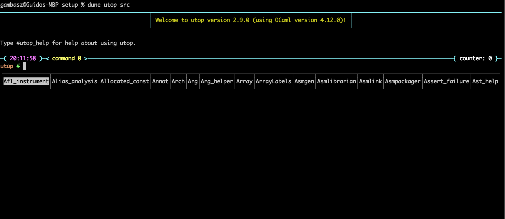

Once we have opened utop we can start interactively testing our code.

Recall that we made available a Sets module for you to use when implementingall your functions. Again, we strongly encourage you to use it as it'll make implementing them much easier.

First, we suggest you try some of the functions in it. However, you'll notice that you're not able to access them directly. You might've tried to do something like this:

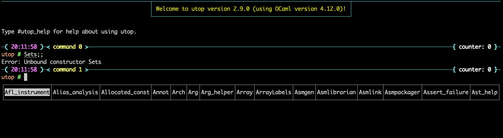

The reason why is because the Sets module is not simply available from the top level, but rather it is nested within the general P3 module that we're using for this project. It doesn't necesarilly make a difference, but it is the way it is implemented.

Thus, instead of opening Sets, try opening "P3", like so:

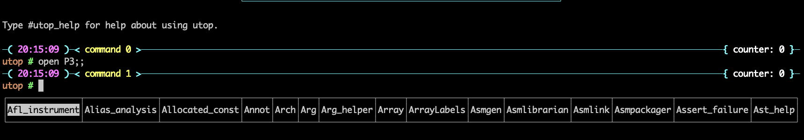

You'll notice you'll get no errors, and we can actually see what's available under P3, like so:

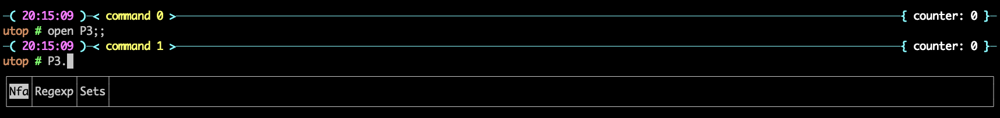

Aha! There it is. Notice that you have access to the Nfa, Regexp and Sets module via P3. **However**, the Nfa and Regexp where already "opened" when you loaded our src when calling ```dune utop src```, which means that we don't need to preface their calls in any way. Further as we look at some examples we'll see different ways to call them.

In the case of the Sets module however, we must preface it with Sets.something in order to use its functions, like so:

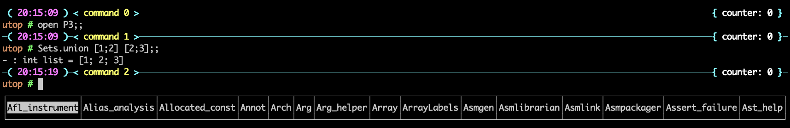

We encourage you to try the different functions available in the sets.ml file to get a sense for how they work and where you might use them.

## Interactively Testing your Code

Now let's look at some examples of how you might want to interactively test your code. First, I'll make an nfa example record we'll use. I'll use the same one from the project README, which is this one:

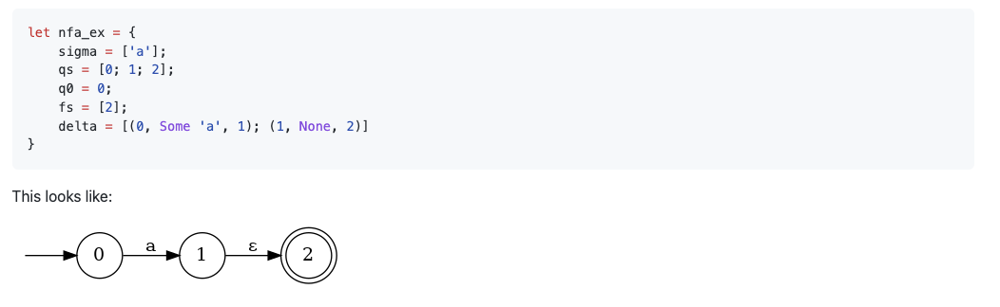

Now, let's actually write it out:

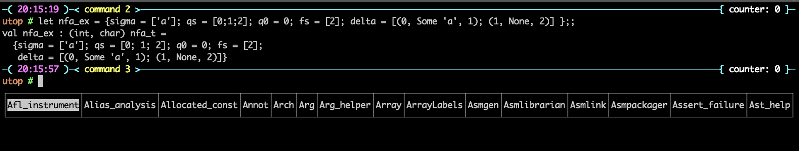

Now let's run e-closure on it:

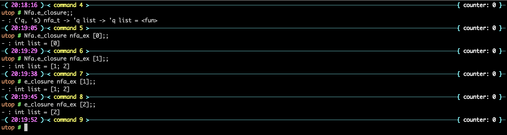

Now other functions:

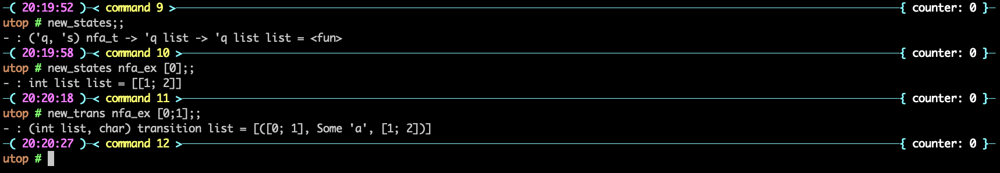

Now let's convert it to a DFA!

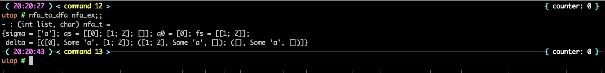

## Regex Portion

Now that should have given you a sense of how you can interactively make examples and test your code. Let's look at how you'd do this with the regex module as well. Let's create a regex:

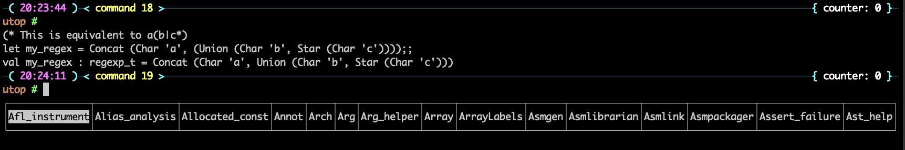

Let's turn it into an NFA:

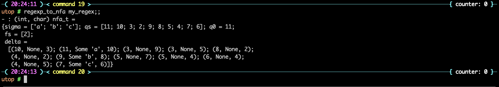

And now let's test it!

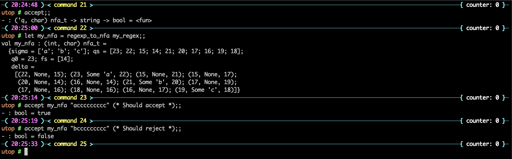


## Visualization script

#### 1. Regex to NFA

Now, let's check out the visualization script that is already given to you in the repository. But for this, you will need to implement the algorithm to convert regex to nfa (don't worry if they are not right, they just need to compile).

If you look at the root directory of your project 3, you will find a script `./viz.sh` file that we will run now. 

Navigate to your root directory in the terminal.

Now, run this command: `env OCAMLPATH=dep dune exec bin/viz.bc`. You can also run `./viz.sh` but you will get a `permission denied` error. Run `chmod +x ./viz.sh` and now you should be able to run `./viz.sh`.

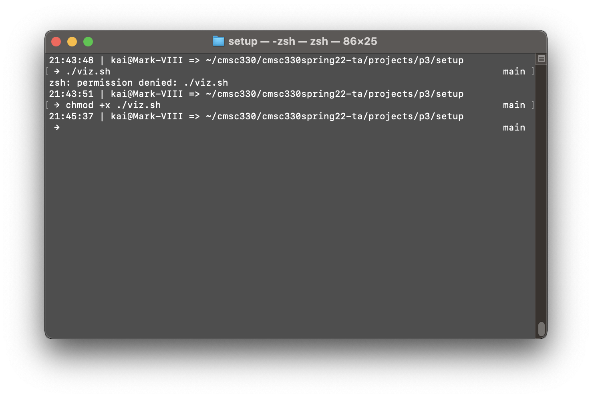

It should look something like this.

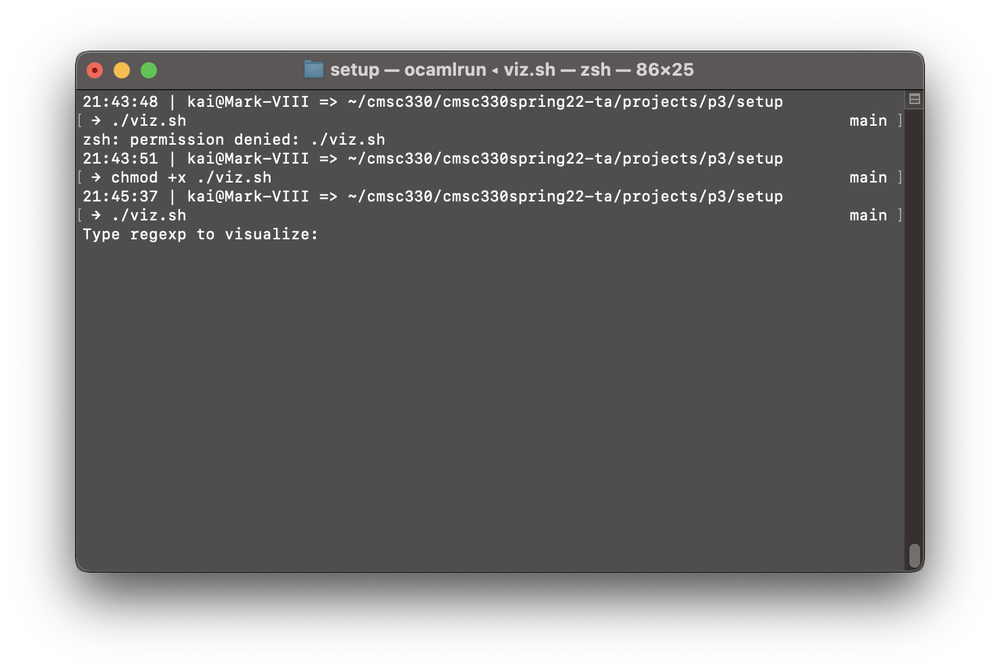

This should prompt you to enter a regex. Enter the regex with the operation you are testing your algorithm for. For the first example, I will the following simple regex.

`a|b`

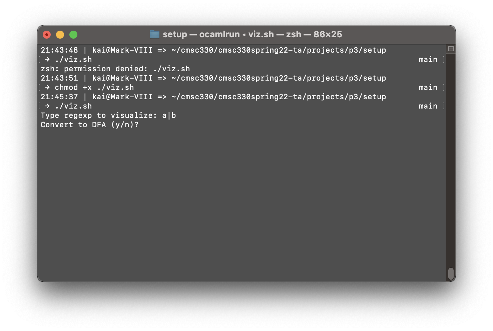

Now, it should prompt you to confirm if you want to convert your nfa to dfa. Enter `n`. When it is done, it will create an image under the name `output.png` in the project's root directory.

**Union:**
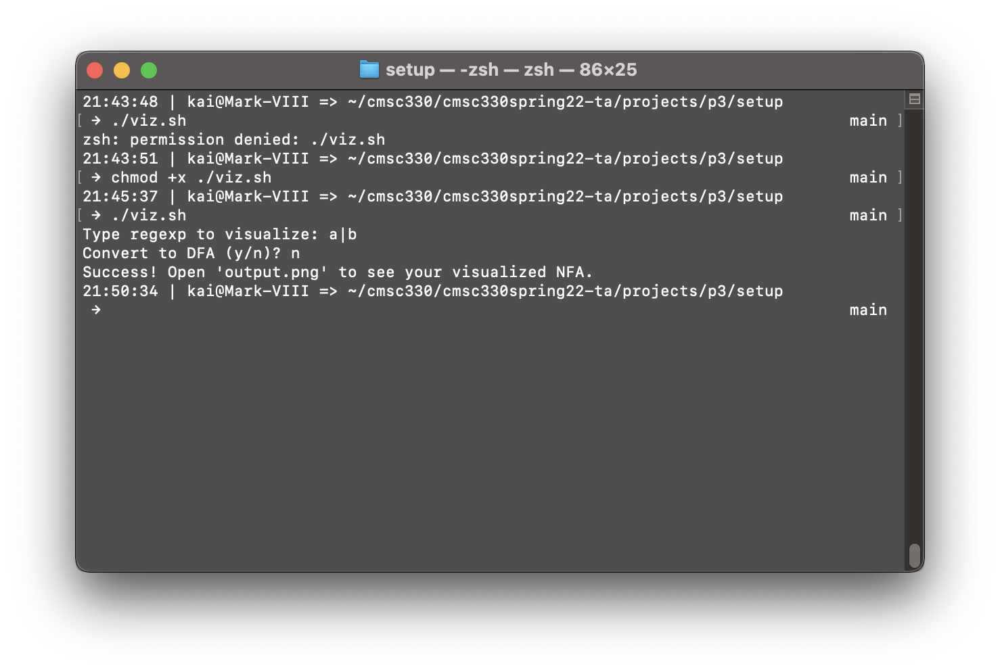

Check your `output.png` and it should have the nfa your algorithm produced. If your algorithm is right, you should see the nfa something like the following. 

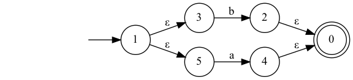

If it does not, you can visually inspect what is wrong, e.g. missing or additional transitions, states, or wrong final states, etc.

You can try out different regex to check your algorithm.

**Concatenation:**
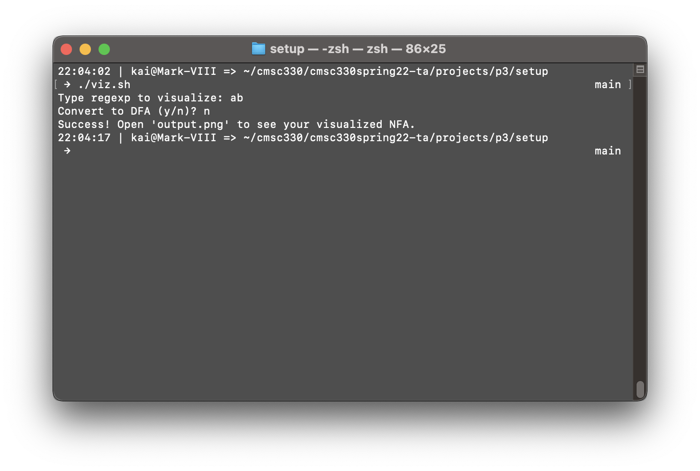
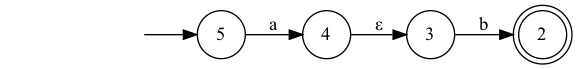

**Star:**
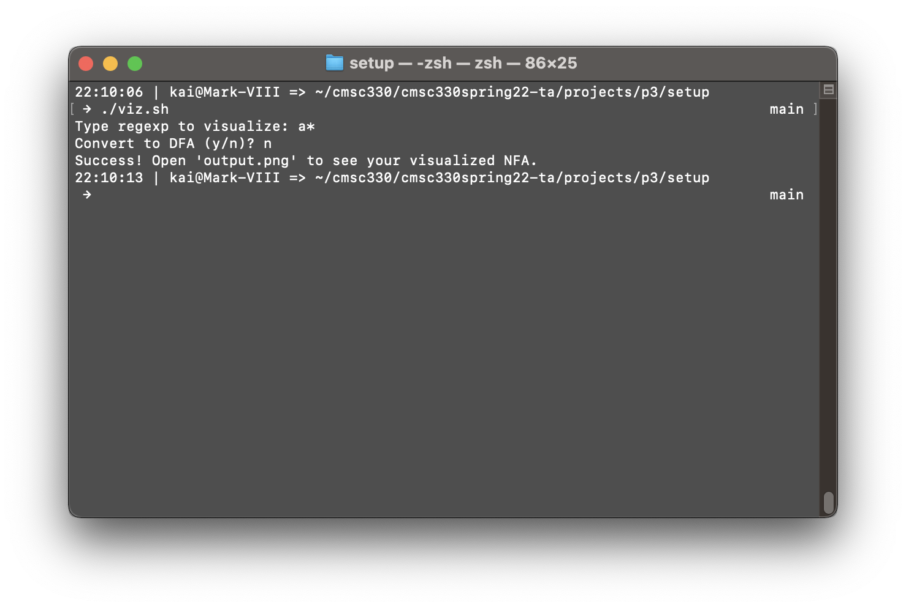
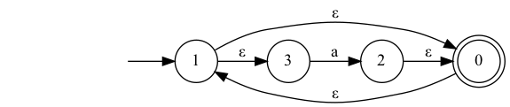

#### 2. NFA to DFA

Now that we have seen how we can rectify our algorithm for `Regex to NFA`, let's look at how we can do the same for `NFA to DFA`.

Steps for this are no different except at the second step. As you guessed it, you now have to enter `y` instead of `n` when asked `Convert to DFA?`. Since we are running the same script, we will get the output in the same directory under the same name. Here is an example:

**Corresponding NFA:**


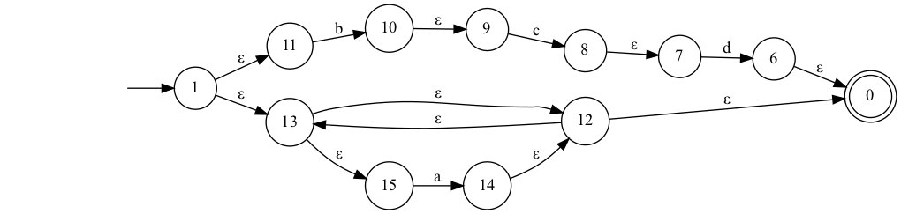

**Corresponding DFA:**


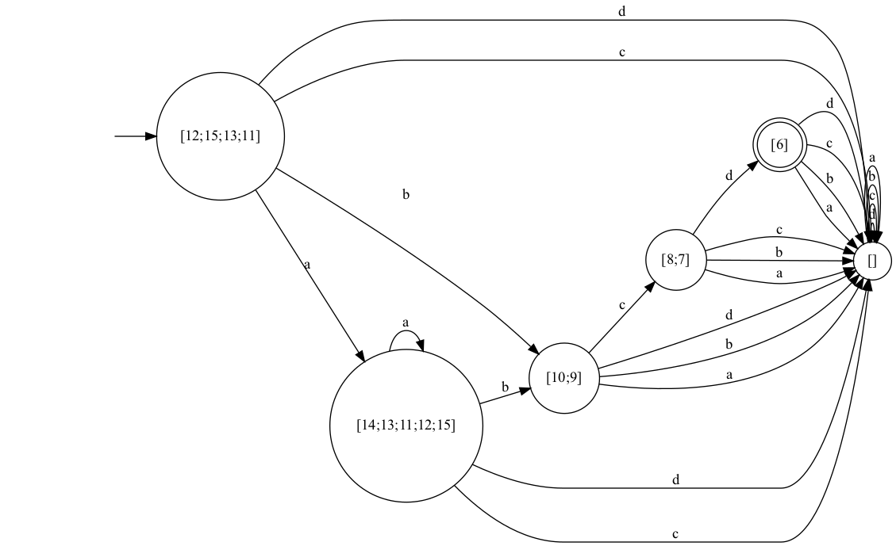

Wait wait wait! Don't panic yet by the output of your NFA to DFA algorithm. It will look horrible. That is because of the dead state. If you ignore the dead state and all of the transitions leading to thedead state, you will get a cleaner DFA. Now, if your algorithm is buggy, you should see something wrong with your DFA and it should easier to debug with the image.

---

#### Pro Tip:
When checking NFA to DFA, always make sure first that your algorithm is producing the correct NFA. Incorrect NFA will lead to incorrect dfa conversion.

---

That is all you need for project 3. Godspeed!

`Made with ❤️ by Guido and Jay!`